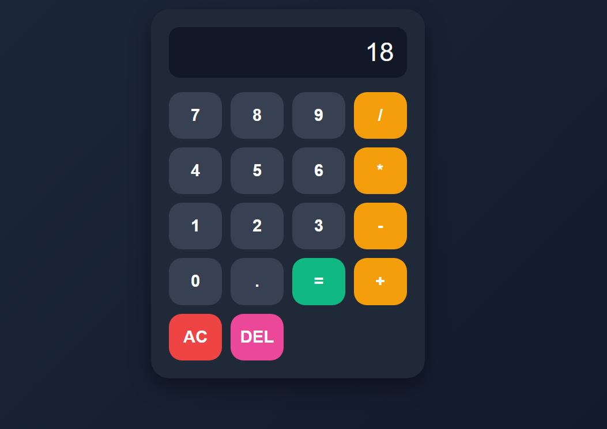

# React Calculator

A modern and responsive calculator built using **React.js**. This project performs basic arithmetic operations and demonstrates the use of React Hooks, event handling, state management, and dynamic rendering.

---

## Live Demo

🔗 https://your-vercel-link.vercel.app

---

## 📸 Preview



---

## Features

- ➕ Addition
- ➖ Subtraction
- ✖️ Multiplication
- ➗ Division
-  Delete (DEL) functionality
-  All Clear (AC)
-  Instant calculation
-  Fully responsive design
-  Modern and clean UI

---

##  Built With

- React.js
- JavaScript (ES6+)
- HTML5
- CSS3
- React Hooks (`useState`)

---

##  Concepts Practiced

- Functional Components
- State Management
- Event Handling
- Dynamic Rendering using `.map()`
- Conditional Rendering
- Array Mapping
- JavaScript `eval()` Method
- Responsive UI Design

---

##  Project Structure

```
src/
│── App.jsx
│── App.css
│── main.jsx
```

---

##  Getting Started

Clone the repository

```bash
git clone <your-github-link>
```

Install dependencies

```bash
npm install
```

Run the project

```bash
npm run dev
```

---

## Future Improvements

- Keyboard support
- Calculation history
- Scientific calculator functions
- Dark/Light mode
- Replace `eval()` with a custom expression parser

---

## Author

**Reshma**

GitHub: https://github.com/Reshma0927

LinkedIn: https://www.linkedin.com/in/gandetireshma0927